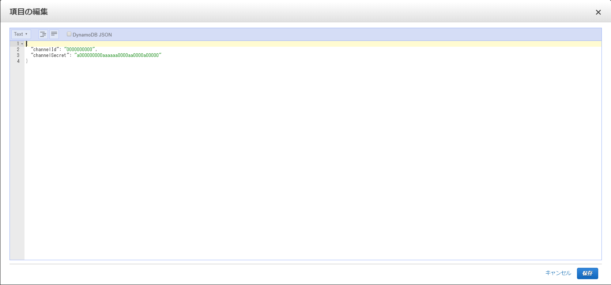
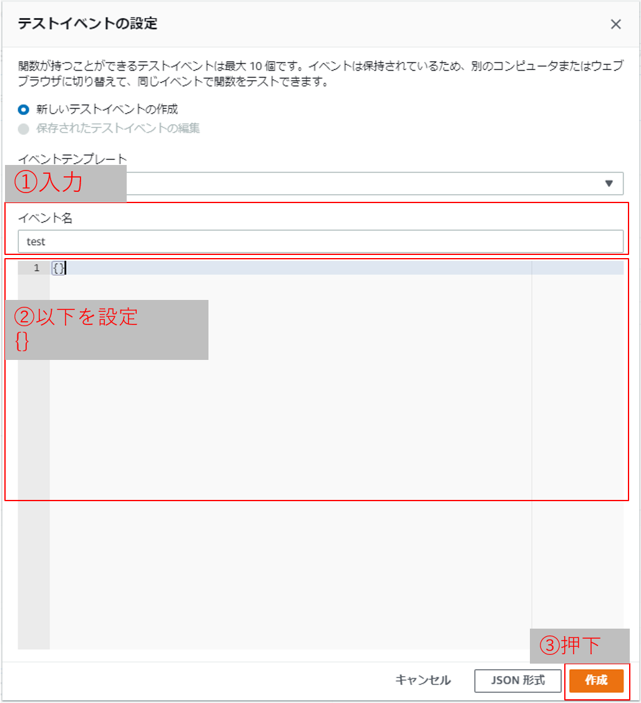

# バックエンドの構築手順

## 周辺リソースのデプロイ

本アプリでは以下の周辺リソースをデプロイする必要があります。

1. 共通処理レイヤー(Layer)
1. 定期実行バッチ(batch)

### 1.共通処理レイヤー(Layer)

AWS Lambda では複数 Lambda 関数で共通化して利用したい処理をレイヤーとして記述することが出来ます。
本アプリではレイヤーを利用しているので、はじめに以下の手順で、レイヤーをデプロイしてください。

- template.yaml の修正  
  backend-> Layer フォルダ内の template.yaml を開き、EnvironmentMap の dev の以下のパラメータ項目を修正する。

  - `LayerName` 任意のレイヤー名

- 以下コマンドの実行

```
cd [backend -> Layerのフォルダ]
sam build --use-container
sam deploy --guided
※プロファイル情報(default)以外を使用する場合は指定必要 sam deploy --guided --profile xxx
    Stack Name : 任意のスタック名
    AWS Region : ap-northeast-1
    Parameter Environment: dev
    #Shows you resources changes to be deployed and require a 'Y' to initiate deploy Confirm changes before deploy [Y/n]: Y
    #SAM needs permission to be able to create roles to connect to the resources in your template Allow SAM CLI IAM role creation[Y/n]: Y
    Save arguments to samconfig.toml [Y/n]: Y

    SAM configuration file [samconfig.toml]: 入力せずEnter 
    SAM configuration environment [default]: 入力せずEnter
    
    Deploy this changeset? [y/N]: y
```

- レイヤーバージョンをメモ  
  デプロイ後、ターミナルの Outputs の項目に、レイヤー ARN とレイヤーバージョンが表示されるので、レイヤーバージョンをメモしておく。  
  レイヤーバージョンは末尾の数字。  
  ※バージョンはデプロイするたびに更新されるので、初めてのデプロイの場合バージョン 1 となっているのが正しいです。
  

- 【確認】AWS マネジメントコンソールで Lambda のコンソールを開き、左タブから「レイヤー」を選択し、今回デプロイしたレイヤーがあることを確認する。

### 2.定期実行バッチ(batch)
本アプリで必要な短期チャネルアクセストークン更新バッチをデプロイします。
短期チャネルアクセストークンは有効期限が取得後 30 日間なので、有効期限の前に短期チャネルアクセストークンを再取得してテーブル更新をするバッチを毎日定刻に動作させています。  
定刻にバッチを動作させるために、Amazon EventBridge([公式ドキュメント](https://docs.aws.amazon.com/ja_jp/eventbridge/latest/userguide/what-is-amazon-eventbridge.html))を用いています。  
以下の手順に従い、バッチのデプロイを行ってください。

- template.yaml の修正  
  backend-> batch フォルダ内の template.yaml を開き、EnvironmentMap の dev の以下のパラメータ項目を修正する。

  - `LINEChannelAccessTokenDBName` 任意のテーブル名(短期チャネルアクセストークンを管理するテーブル)
  - `EventBridgeName` 任意のイベントブリッジ名  
    例) AccessTokenUpdateEvent
  - `LayerVersion` 【1.共通処理レイヤー】の手順にてデプロイしたレイヤーのバージョン番号  
    例）LayerVersion: 1
  - `LoggerLevel` INFO or Debug  
    例）INFO

- 以下コマンドの実行

```
cd [backend -> batch]のtemplate.yamlが配置されたフォルダ]
sam build --use-container
sam deploy --guided
※プロファイル情報(default)以外を使用する場合は指定必要 sam deploy --guided --profile xxx
    Stack Name : 任意のスタック名
    AWS Region : ap-northeast-1
    Parameter Environment: dev
    #Shows you resources changes to be deployed and require a 'Y' to initiate deploy Confirm changes before deploy [Y/n]: Y
    #SAM needs permission to be able to create roles to connect to the resources in your template Allow SAM CLI IAM role creation[Y/n]: Y
    Save arguments to samconfig.toml [Y/n]: Y

    SAM configuration file [samconfig.toml]: 入力せずEnter 
    SAM configuration environment [default]: 入力せずEnter
    
    Deploy this changeset? [y/N]: y
```

- テーブルにチャネル ID とチャネルシークレットを登録する
  - AWS マネジメントコンソールにログインし、DynamoDB のコンソールを開く
  - 先ほど作成した「短期チャネルアクセストークンを管理するテーブル」にて項目の作成を行い、【LINE チャネルの作成】で作成したMessaging APIのチャネルのチャネル ID とチャネルシークレットを以下の通り登録する。
    なお、チャネル ID とチャネルシークレットは[LINE Developers コンソール](https://developers.line.biz/console/)のチャネル基本設定にて確認可能。
    - channelId: チャネル ID (文字列)
    - channelSecret : チャネルシークレット(文字列)
      
- チャネルアクセストークン更新の Lambda 関数を実行する
  - AWS マネジメントコンソールにログインし、Lambda のコンソールを開く
  - 先ほど作成した Lambda 関数(関数名は TableOrder-PutAccessToken-{Enviromentで指定した値})を開く
  - Lambda 関数のコンソール右上、テストイベントの選択プルダウンにて「テストイベントの設定」を選択する
  - 以下のようなウィンドウが開いたら、イベント名を入力し、イベント内容を空にして作成ボタンを押下する。
    
  - Lambda 関数のコンソール右上、テストボタンを押下してテスト実行を行う
- 【確認】AWS マネジメントコンソールの DynamoDB コンソールにて、チャネルアクセストークンのテーブル開き、本アプリで利用する LINE チャネル ID のデータに channelAccessToken,limitDate,updatedTime の項目が追加されていることを確認する。

## アプリのデプロイ(APP)

以下の手順で、アプリ本体をデプロイしてください。

- template.yaml の修正  
  backend -> APP フォルダ内の template.yaml を開き、EnvironmentMap の dev の以下のパラメータ項目を修正する。
  ※S3のアクセスログが必要な場合、ACCESS LOG SETTING とコメントされている箇所のコメントを解除してください。

  - `LineChannelId` 【LINE チャネルの作成】で作成したMessaging APIチャネルのチャネル ID
  - `LIFFChannelId` 【LINE チャネルの作成】で作成したLIFFチャネルのチャネル ID
  - `LiffUrl` 【LINE チャネルの作成】で作成したLIFFアプリの LIFF URL
  - `LinePayChannelId` 【LINE チャネルの作成】で作成したLINE Payチャネルのチャネル ID
  - `LinePayChannelSecret` 【LINE チャネルの作成】で作成したLINE Payチャネルのチャネルシークレット  
  - `LinePayIsSandbox` True or False  
    ※基本Trueを指定してください。  
    True: Sandbox環境を使用します。LINEPayによる課金は行われません。  
    False: LINEPay「テスト加盟店環境」を使用します。一時的に利用者のLINEPay残高が実際に引き落とされた状態となり、一定時間後に利用額が返金されます。
  - `ItemListDBName` 任意のテーブル名（商品情報を登録するテーブル）
  - `PaymentInfoDBName` 任意のテーブル名（支払い情報を登録するテーブル）
  - `LINEChannelAccessTokenDBName` 【2.定期実行バッチ】の手順でデプロイした「短期チャネルアクセストークンを管理するテーブル」のテーブル名
  - `FrontS3BucketName` 任意のバケット名 ※フロント側モジュールを配置するための S3 バケット名になります。
  - `LayerVersion` 【1.共通処理レイヤー】の手順にてデプロイしたレイヤーのバージョン番号  
    例）LayerVersion: 1  
  - `LoggerLevel` INFO or Debug  
  - `LambdaMemorySize` Lambdaのメモリサイズ  
    例）LambdaMemorySize: 128 ※特に変更する必要がない場合、最小サイズの128を指定してください。
  - `TTL` True or False (注文情報を自動で削除するか否か)
  - `TTLDay` 任意の数値 （TTLがTrueのとき、予約情報を登録から何日後に削除するか指定。TTLがFalseのとき、0を入れてください。）
  - `LogS3Bucket` 任意のバケット名(アクセスログを保管するS3の名称)  
  ※アクセスログが必要な場合のみコメントを解除して記載してください。また、他UseCaseアプリを構築済みの方は、他UseCaseアプリのアクセスログバケット名と別名で指定してください。
  - `LogFilePrefix` 任意の名称（ログファイルの接頭辞）  
  ※アクセスログが必要な場合のみコメントを解除して記載してください。

- 以下コマンドの実行

```
cd [backend -> APP のフォルダ]
sam build --use-container
sam deploy --guided
※プロファイル情報(default)以外を使用する場合は指定必要 sam deploy --guided --profile xxx
    Stack Name : 任意のスタック名
    AWS Region : ap-northeast-1
    Parameter Environment: dev
    #Shows you resources changes to be deployed and require a 'Y' to initiate deploy Confirm changes before deploy [Y/n]: Y
    #SAM needs permission to be able to create roles to connect to the resources in your template Allow SAM CLI IAM role creation[Y/n]: Y
    ××××× may not have authorization defined, Is this okay? [y/N]: y (全てyと入力)  
    Save arguments to samconfig.toml [Y/n]: Y

    SAM configuration file [samconfig.toml]: 入力せずEnter 
    SAM configuration environment [default]: 入力せずEnter
    
    Deploy this changeset? [y/N]: y
```

- API Gateway endpoint URLとCloudFrontDomainNameのメモ  
デプロイ成功時にOutPutにて表示されるAPI Gateway endpoint URLとCloudFrontDomainNameのメモを取ってください。
## エラー対応
- デプロイ時、以下のようなエラーが出た場合、こちらの手順で解消してください。
  ```
  Export with name xxxxx is already exported by stack sam-app. Rollback requested by user.
  ```
  - backend -> Layer -> template.yamlを以下を参考に、修正後デプロイ
    ```
    Outputs:
      UseCaseLayerName:
        Description: "UseCaseLayerDev Layer Name"
        Value: !FindInMap [EnvironmentMap, !Ref Environment, LayerName]
        Export:
          Name: TableOrderLayerDev -> こちらを任意の名称に修正
    ```
  - backend -> batch -> template.yamlを、以下の記載を参考に修正する。複数あるので、すべて修正する。
    ```
    !ImportValue TableOrderLayerDev -> TableOrderLayerDev を先ほど入力した名称に修正
    ```
  - backend -> APP -> template.yamlを、以下の記載を参考に修正する。複数あるので、すべて修正する。
    ```
    !ImportValue TableOrderLayerDev -> TableOrderLayerDev を先ほど入力した名称に修正
    ```

※本番環境構築中の方はこちらのリンクで次の頁へ移動してください  
[次の頁へ（本番環境）](front-end-construction.md)

※ローカル環境構築中の方はこちらのリンクで次の頁へ移動してください  
[次の頁へ（ローカル環境）](front-end-development-environment.md)

[目次へ戻る](../README.md)